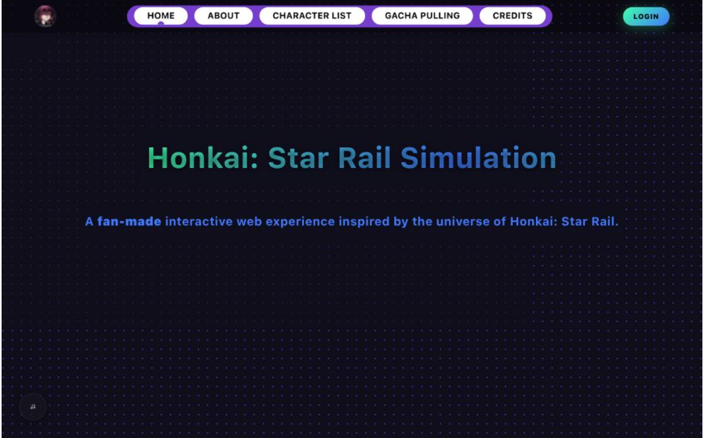

# Honkai: Star Rail Fan Site

[](https://opensource.org/licenses/MIT)
[](https://vitejs.dev/)
[](https://reactjs.org/)

An interactive fan-made web application for Honkai: Star Rail, featuring a character roster, gacha simulation, and warp simulator with stunning visual effects.

## 🔗 Live Demo

**Live Demo:** [https://hsrfansitevercel.vercel.app/](https://hsrfansitevercel.vercel.app/)



## ✨ Features

* **Interactive Character Roster** - Browse detailed profiles of your favorite Honkai: Star Rail characters
* **Gacha Simulation** - Experience the thrill of the gacha system with realistic warp mechanics
* **Warp Simulator** - Visual and audio effects that mimic the in-game experience
* **In-Game Music Player** - Enjoy the official Honkai: Star Rail soundtrack while browsing
* **Responsive Design** - Works seamlessly on desktop, tablet, and mobile devices
* **User Authentication** - Save your favorite characters and pull history

## 🚀 Technologies Used

* **Frontend Framework**: React 18
* **Build Tool**: Vite
* **Styling**: CSS Modules, Custom Animations
* **State Management**: React Context API
* **Routing**: React Router v6
* **UI Components**: Custom-built with React

## 📦 Live Deployment Repository

[https://github.com/kelvindokhoi/hsr_fansite_vercel](https://github.com/kelvindokhoi/hsr_fansite_vercel)

## 🛠️ Getting Started

### Prerequisites

* Node.js (v16 or later)
* npm (v8 or later) or yarn
* MAMP (for local MySQL database)

### Installation

1. Clone the repository:

   ```bash
   git clone https://github.com/kelvindokhoi/hsr_fansite.git
   cd hsr_fansite
   ```

2. Install frontend dependencies:

   ```bash
   npm install
   # or
   yarn
   ```

> **Note:** This project also includes backend-related dependencies (Express, MySQL, authentication utilities) that are required for full functionality, including database access and user data persistence.

### Database Setup (MySQL via MAMP)

This project requires a local MySQL database and a Node.js backend to enable features such as user data persistence, authentication, and pull history tracking.

1. Install and launch **MAMP** (or MAMP PRO).

2. Start the Apache and MySQL servers, then open the following URL in your browser:

   ```
   http://localhost/phpMyAdmin/
   ```

3. In phpMyAdmin:

   * Navigate to the **SQL** tab
   * Open and execute the following file:

     ```
     DBdump/hsr_fansite(export_data).sql
     ```

   This will create the required database schema and populate it with initial data.

4. Ensure the following backend-related npm packages are installed (they are included in `package.json`):

   * `express` – backend server
   * `mysql` / `mysql2` – MySQL database connection
   * `cors` – cross-origin request handling
   * `dotenv` – environment variable management
   * `bcrypt` – password hashing
   * `jsonwebtoken` – authentication tokens

5. Configure your database connection settings (e.g. host, user, password, database name) using environment variables or a configuration file as required by the backend.

### Running the Application

3. Start the development server:

   ```bash
   npm run dev
   # or
   yarn dev
   ```

4. Open [http://localhost:5173](http://localhost:5173) in your browser.

## 📂 Project Structure

```
src/
├── assets/          # Static assets (images, fonts, etc.)
├── components/      # Reusable UI components
├── context/         # React context providers
├── css/             # CSS modules and global styles
├── pages/           # Page components
└── theme/           # Theme configuration
```

## 🤝 Contributing

Contributions are welcome! Please feel free to submit a Pull Request.

1. Fork the repository
2. Create your feature branch (`git checkout -b feature/AmazingFeature`)
3. Commit your changes (`git commit -m 'Add some AmazingFeature'`)
4. Push to the branch (`git push origin feature/AmazingFeature`)
5. Open a Pull Request

## 📄 License

This project is licensed under the MIT License - see the [LICENSE](LICENSE) file for details.

## 🙏 Acknowledgments

* Honkai: Star Rail and all related content are property of miHoYo/HoYoverse.
* This is a fan-made project not affiliated with or endorsed by miHoYo/HoYoverse.
* All game assets are used under fair use for educational and entertainment purposes only.

---

Made with ❤️ by [Kelvin] | [LinkedIn](https://linkedin.com/in/kelvindokhoi/) | [GitHub](https://github.com/kelvindokhoi)
